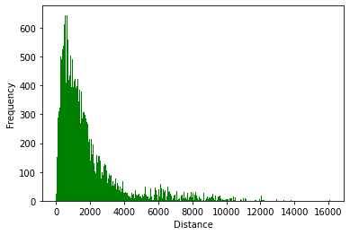

# **Analyzing Airport Data**
This lab conducts studies and practices on a python library CSV. Students use real-life data from the open flight website (all required data are stored in the data folder in this repository) to create a distance-frequency histogram. Students should first learn how to call rows with wanted information in the CSV file by creating loops. Then students create two dictionaries to hold latitude and longitude information of each airport based on their indexes and, based on this information to calculate the distances of each flight. The function used to calculate distances copied from the geo_distance.py file is located under the root file. Finally, students use another library to plot the output in the histogram. The final output pasted below:

The most challenging part of this lab is debugging.  I have a hard time creating the histogram with a proper x-axis where the lowest value on the left and the highest value on the right. All previous codes seem to work correctly as no error was encountered. However, after hours of debugging, I found a fatal bug in which I store the distance result, calculated using the geo_distance function, in string instead of float. After I fixed this issue, the histogram revels its proper shape -- a right-skewed distribution of distance-flight frequency where the most frequent flights are less than 1000 miles. 
